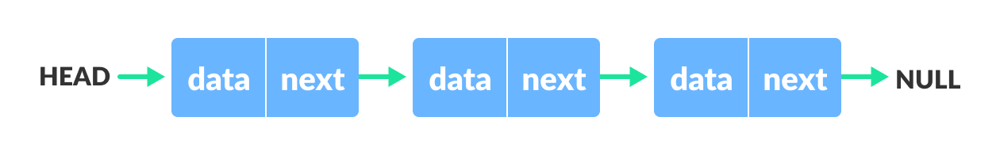
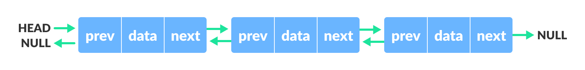
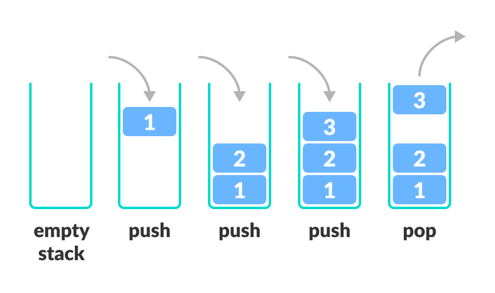
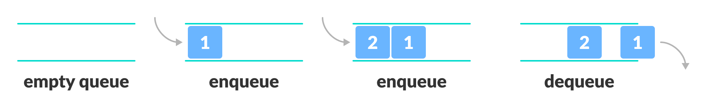
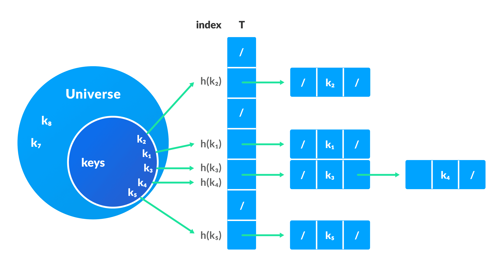

# Java Data Structures and Algorithms

Repository for Data structures and Algorithms using Java.

## Software required

| Type | Software                        | Version   |
| ---- | ------------------------------- | --------- |
| JDK  | Java Enterprise Edition         | 1.8.0_271 |
| IDE  | IntelliJ Idea Community edition | 2020.3.1  |

## Data Structures

### Arrays

-   [Static Arrays implementation](DataStructures/StaticArrays/src/com/dhanush/array/ArrayList.java)
-   [Dynamic Arrays implementation](DataStructures/DynamicArrays/src/com/dhanush/array/ArrayList.java)

### Linked Lists

-   [Singly Linked List implementation](DataStructures/LinkedList/src/com/dhanush/linkedList/SinglyLinkedList.java)
-   [Doubly Linked List implementation](DataStructures/LinkedList/src/com/dhanush/linkedList/DoublyLinkedList.java)

### Stacks

-   [Array-based stack implementation](DataStructures/Stacks/src/com/dhanush/stack/ArrayStack.java)
-   [Linked list-based stack implementation](DataStructures/Stacks/src/com/dhanush/stack/ListStack.java)

### Queues

-   [Array Queue implementation](DataStructures/Queues/src/com/dhanush/queue/ArrayQueue.java)
-   [Stack Queue implementation](DataStructures/Queues/src/com/dhanush/queue/StackedQueue.java)

### Hash Table

-   [Hash Table implementation with chaining](DataStructures\HashTables\src\com\dhanush\hashtable\HashTable.java)

> I don't own any of the photos. They have been taken from [Programiz/DSA](https://www.programiz.com/dsa)
